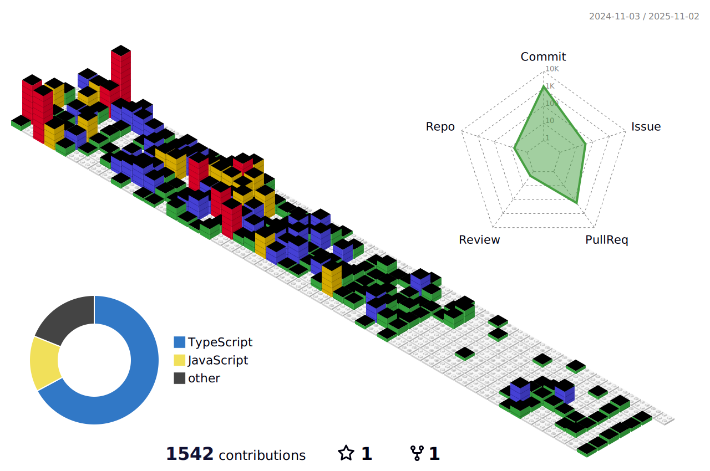

  

	<h2>📚 Tech Stack 📚</h2>

	
          
          
          
          
           
          
          
          
          
           
          
          
          
          
           
          
          
          
          
           
    
 

 
 

	<h2> 🧑‍💻 Contact me </h2>

 
         
         

	

    
